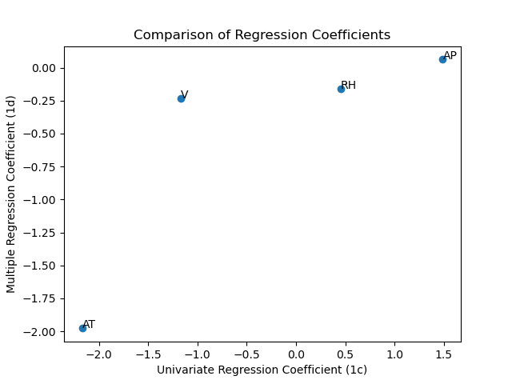
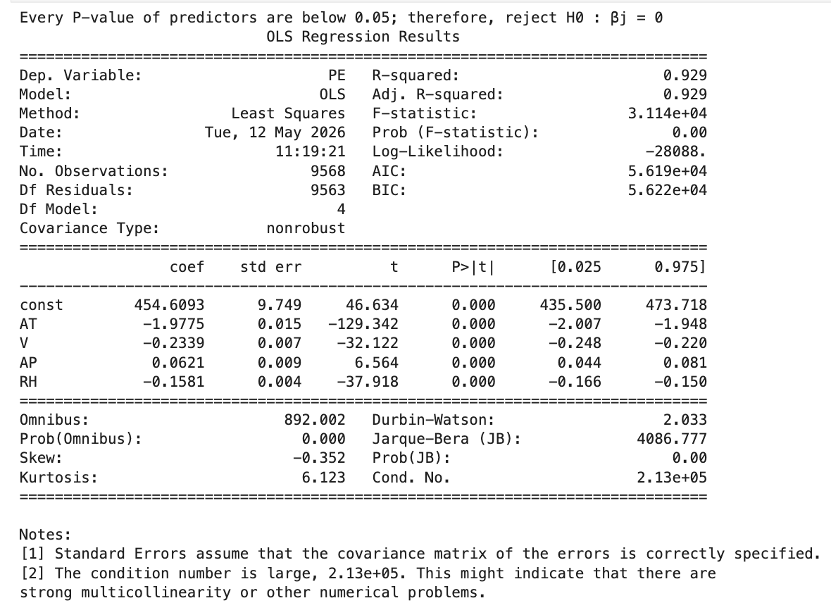
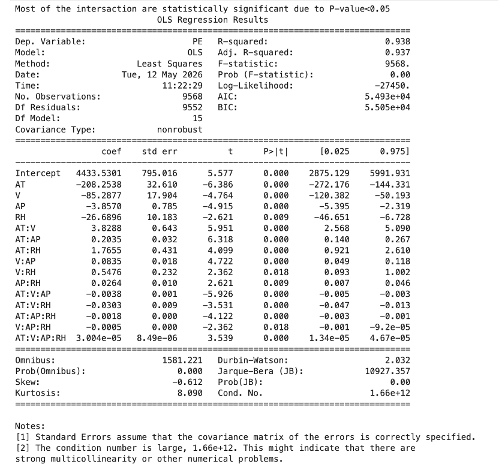
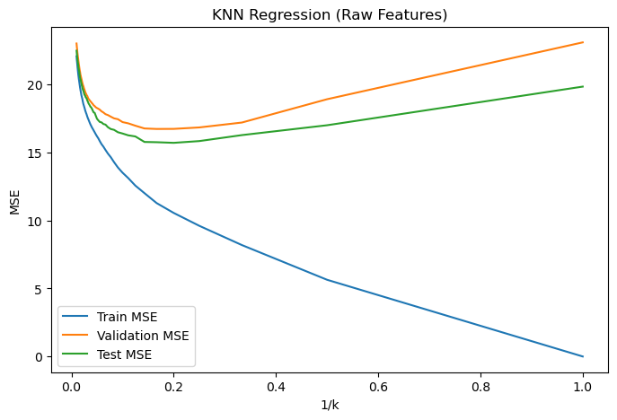
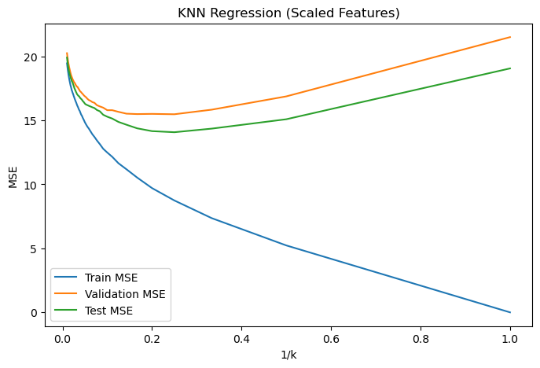

# Combined Cycle Power Plant Data Analysis

This project analyzes the **Combined Cycle Power Plant (CCPP)** dataset and compares several regression approaches for predicting the net hourly electrical energy output (`PE`).

---

## 🚀 Highlights

- 📉 **Best Model:** KNN with standardized features achieves the lowest test MSE (**14.07**)  
- 📈 **Performance Gain:** ~**32% improvement** over linear regression (20.78 → 14.07)  
- 🔄 **Nonlinearity Detected:** Polynomial and KNN outperform linear models, indicating nonlinear relationships  
- 🔗 **Interaction Effects:** Significant interactions exist between predictors, but full interaction models suffer from multicollinearity  
- ⚖️ **Model Trade-off:**  
  - Linear → most interpretable  
  - Polynomial → balanced  
  - KNN → best performance  
- ⚙️ **Feature Scaling Matters:** Standardization significantly improves KNN results  
- 📊 **Robust Evaluation:** Cross-validation used to select optimal k and avoid overfitting

---

## 📂 Dataset
The Combined Cycle Power Plant (CCPP) dataset contains operational data collected from a real-world power plant over approximately 6 years (2006–2011). The dataset is commonly used for regression tasks, where the goal is to predict the plant’s electrical energy output based on environmental conditions.

The dataset includes the following variables:

- `AT` — Ambient Temperature
- `V` — Exhaust Vacuum
- `AP` — Ambient Pressure
- `RH` — Relative Humidity
- `PE` — Net hourly electrical energy output (target)

---

## ⚠️ Key Challenges

Working with the CCPP dataset involves several practical and modeling challenges:

### 🔹 Nonlinear Relationships
The relationship between environmental variables and power output (PE) is not strictly linear.  
This makes simple linear models insufficient unless enhanced with interaction terms or compared with more flexible methods like KNN.

### 🔹 Interaction Effects
The effect of one predictor may depend on another (e.g., temperature interacting with humidity).  
Identifying significant interaction terms is essential for improving model accuracy and interpretation.

### 🔹 Feature Scaling (Important for KNN)
The features have different units and ranges.  
For distance-based models like KNN:
- Without scaling → certain variables dominate distance calculations  
- With scaling → all features contribute more equally  

### 🔹 Model Selection (Choosing k in KNN)
Selecting the optimal number of neighbors (k) is critical:
- Small k → overfitting  
- Large k → underfitting  

Cross-validation is required to find a stable and optimal value.

### 🔹 Overfitting vs Underfitting
Balancing model complexity is a key challenge:
- Linear regression may underfit  
- KNN with small k may overfit  

### 🔹 Multicollinearity (Regression Models)
Including multiple predictors and interaction terms may introduce correlation between variables.

### 🔹 Evaluation Stability
Model performance may vary depending on data splitting.  
Using cross-validation helps produce more reliable results.

---

## 🧠 Methodology

This project combines statistical modeling and machine learning approaches to analyze and predict the power output (`PE`).

---

### 🔹 Data Preparation
- Predictors: `AT`, `V`, `AP`, `RH`
- Target: `PE`
- Dataset split into **70% training / 30% testing**
- Applied **StandardScaler** for KNN models

---

### 🔹 Rationale for Model Selection

We selected three types of models—Multiple Linear Regression, Polynomial Regression, and KNN—to capture different levels of model complexity and data structure.

- **Multiple Linear Regression**
  - Serves as a baseline model  
  - Assumes a linear relationship between predictors and the response  
  - Provides high interpretability through coefficients  

- **Polynomial Regression (Degree = 2)**
  - Extends the linear model by including:
    - Pairwise interaction terms  
    - Quadratic (nonlinear) terms  
  - Allows us to capture moderate nonlinear relationships and interactions  
  - Maintains some interpretability compared to more complex models  

- **KNN (Standardized)**
  - A non-parametric model that makes no assumption about the functional form  
  - Captures complex, local, and nonlinear patterns in the data  
  - Used to evaluate the upper bound of predictive performance  

---

### 📌 Insight

- These three models represent increasing levels of flexibility:
  - Linear → Polynomial → KNN  

- This progression allows us to:
  - Understand whether the relationship is linear  
  - Detect the presence of interaction and nonlinear effects  
  - Evaluate the trade-off between interpretability and predictive accuracy  

> By comparing these models, we can determine the appropriate level of model complexity for the dataset.
---

### 🔹 Hyperparameter Tuning
- Used **10-fold cross-validation (on training set)**
- Selected optimal k by minimizing **MSE**

---

### 🔹 Model Complexity Analysis
- Plotted **MSE vs 1/k**
- Interpretation:
  - Small k → overfitting
  - Large k → underfitting

---

## 📊 Results

## 🔹 Multiple Linear Regression ＆ Polynomial Regression

### 🔹 Comparison of Regression Coefficients


- The coefficients from univariate and multiple regression differ substantially  
- Some variables (e.g., RH) even change sign  
- This indicates the presence of **correlation or confounding among predictors**


### 🔹 Main Effects


- All predictors are statistically significant (p-value < 0.05)  
- The model achieves strong explanatory power (R² ≈ 0.93)  
- However, it assumes independent effects of predictors  


### 🔹 Full Model Interaction


- The full interaction model includes higher-order interaction terms  
- Many interaction terms appear statistically significant  


#### 📌 Insight
- Not all interaction terms are meaningful despite statistical significance  
- The full interaction model suffers from **severe multicollinearity** and potential **overfitting**  
- High model complexity reduces interpretability and stability  
- A simpler model (e.g., pairwise interaction or polynomial degree = 2) is more appropriate


### 🔹 Pairwise Interaction & Quadratic Terms vs Linear Model

| Model | Description | Train MSE | Test MSE |
|------|-------------|----------|----------|
| Linear (Main Effects) | `PE ~ AT + V + AP + RH` | 20.77 | 20.78 |
| Polynomial (Degree = 2) | Pairwise interaction + quadratic terms | 18.06 | 18.22 |

- The polynomial model (degree = 2) includes:
  - Pairwise interaction terms
  - Quadratic (nonlinear) terms

- Compared to the normal linear model (main effects only):
  - The polynomial model captures more complex relationships
  - It allows both interaction effects and nonlinear effects

#### 📌 Insight
- The polynomial model achieves lower MSE than the simple linear model, indicating the presence of interaction and/or nonlinear relationships in the data
- This suggests that the relationship between predictors and PE is not purely linear
- The similarity between training and testing MSE indicates that the model does not suffer from overfitting
- Therefore, a balance between model flexibility and generalization is achieved

---

## 🔷 KNN Performance

### 🔹 KNN Performance Comparison

| Feature Type | Best k (CV) | CV MSE | Best k (Test) | Test MSE | Performance |
|-------------|------------|--------|---------------|----------|------------|
| Raw Features | **6** | **16.73** | **5** | **15.70** | Higher MSE, lower predictive performance |
| Standardized Features | **4** | **15.47** | **4** | **14.07** | Lower MSE, better performance |





---

### 📌 Insight
- Standardization improves KNN performance significantly  
- Optimal k is more stable after scaling  
- Best model: **KNN (standardized, k = 4)**  


### 🔹 Effect of Feature Scaling
- Feature scaling significantly improves KNN performance  
- Reduces MSE from **15.70 → 14.07**  
- Prevents large-scale variables from dominating distance calculations  


### 🔹 Model Complexity (MSE vs 1/k)
- Small k (high 1/k):
  - Very low training error  
  - Higher test error → **overfitting**  

- Large k (low 1/k):
  - Higher training and test error → **underfitting**  

- Optimal k balances bias and variance:
  - Around **k = 4–6**

### 📌 Insight
- KNN is highly sensitive to feature scaling  
- Standardized features consistently outperform raw features  
- Cross-validation provides stable and reliable k selection  
- The best model is **KNN with standardized features (k = 4)**  
---
## 🔷 Model Comparison: Linear vs Polynomial vs KNN

### 🔹 Performance Comparison

| Model | Description | Test MSE | Strengths | Weaknesses |
|------|-------------|----------|-----------|------------|
| Multiple Linear Regression | Main effects only (`PE ~ AT + V + AP + RH`) | **20.78** | Simple, highly interpretable | Cannot capture nonlinear or interaction effects |
| Polynomial Regression (Degree = 2) | Pairwise interaction + quadratic terms | **18.22** | Captures interaction and nonlinear effects | More complex, less interpretable |
| KNN (Standardized) | Distance-based, non-parametric model | **14.07** | Highly flexible, captures local patterns | Sensitive to scaling, no interpretability |

---

### 🔹 Key Insights

- Model performance improves as flexibility increases:
  - Linear → Polynomial → KNN  

- The decrease in MSE indicates:
  - Presence of **nonlinear relationships**
  - Presence of **interaction effects**

- Polynomial model improves over linear regression by:
  - Adding interaction terms  
  - Capturing curvature (quadratic effects)

- KNN achieves the best performance because:
  - It does not assume any functional form  
  - It adapts to local structure in the data  

---

### 🔹 Trade-off

| Aspect | Best Model |
|-------|-----------|
| Interpretability | Linear Regression |
| Balance (Performance + Structure) | Polynomial Regression |
| Predictive Accuracy | KNN |

---

### 📌 Final Conclusion

- Linear regression provides a strong and interpretable baseline  
- Polynomial regression captures additional structure in the data  
- KNN achieves the best predictive performance  

> The results suggest that the relationship between predictors and PE is not purely linear, and more flexible models are required to capture the underlying patterns.
---

## Requirements

Install the Python packages listed in `requirements.txt`.

---

## How to run

1. Make sure the dataset path is correct.
2. Install dependencies:

```bash
pip install -r requirements.txt
```

3. Open and run the notebook:

```bash
jupyter notebook combined-cycle-power-plant-data-analysis.ipynb
```
---

## Notes

- The notebook uses `statsmodels` for OLS regression summaries.
- KNN results are evaluated with cross-validation.
- Standardization is important for KNN because it is distance-based.

